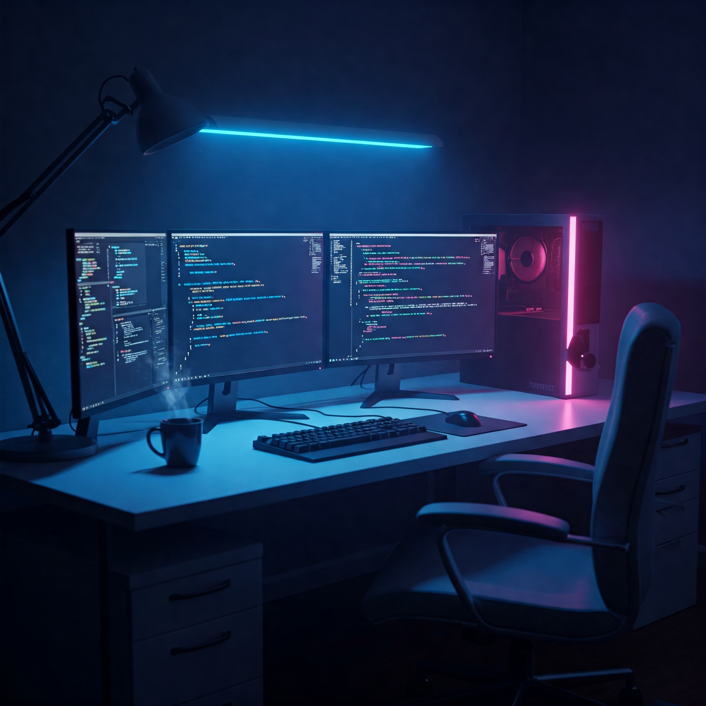

<!-- README.md for GitHub Profile -->

  

<h3 align="center">🚀 Passionate Java Developer | Full-Stack Enthusiast | Tech Explorer</h3>
 

- 🔭 I’m currently working on **Java-based Full Stack Projects ,DevOPS and Backend Development**
- 🌱 I’m currently learning **Spring Boot, Kubernetes, Go, Microservices**
- 👨‍💻 All of my projects are available at [https://github.com/Kalpesh-Vala](https://github.com/Kalpesh-Vala)
- 💬 Ask me about **Java, Python, Web Dev, System Management, DevOPS**
- 📫 How to reach me: **valakalpesh6175@gmail.com**
- ⚡ Fun fact: I spend more time exploring OS internals and new technologies than watching Netflix 😂

---

### 🌐 My Portfolio

🚀 Check out my work, resume, and more on my personal portfolio:  
**🔗 [kalpesh-vala.vercel.app](https://kalpesh-vala.vercel.app)**

---
### 🛠️ Tech Stack

  <!-- Core Languages -->
  
  
  
  

  <!-- Frameworks -->
  
  

  <!-- Databases -->
  
  
  

  <!-- DevOps -->
  
  

---

### 📈 GitHub Stats

  
   
  

---

### 🚀 Featured Projects

| Project | Description | Live Demo |
|--------|-------------|------------|
| 🔐 **Credit Card Fraud Detection** | Flask web app using Isolation Forest & Logistic Regression to detect fraud in transactions. MongoDB used for real-time storage. | [Live Demo](https://credit-card-fraud-detection-2oay.onrender.com) • [GitHub](https://github.com/Kalpesh-Vala/Credit-Card-Fraud-Detection) |
| 🛒 **E-Commerce Platform (JSP)** | Dynamic JSP storefront with MySQL and payment gateway, Dockerized for deployment. | [GitHub](https://github.com/Kalpesh-Vala/JAVA-E-commerce) |
| 🧾 **MyShops - Backend System** | RESTful API backend built using Java, Spring Boot, MySQL with Docker & clean architecture. | [GitHub](https://github.com/Kalpesh-Vala/my-shops) |
| 💬 **Chat + To-Do Web App** | Real-time chat + to-do list with JWT auth using Go (Gin) backend & Next.js frontend. MongoDB & live notifications. | [Live Demo](https://go-next-chat.vercel.app) • [GitHub](https://github.com/Kalpesh-Vala/go-next-chat) |

---

### 📬 Let's Connect

  
  

---

> 💡 *"The best way to predict the future is to invent it." — Alan Kay*

